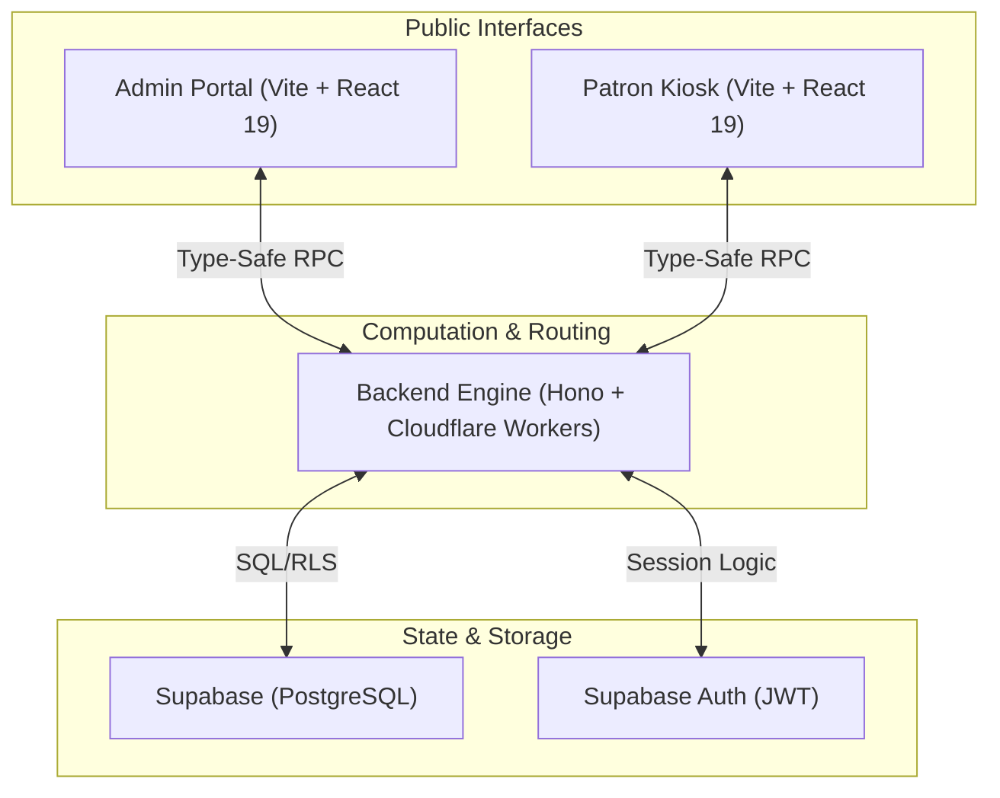

# Thomian Library System (v3.7.1)

A professional-grade, Cloudflare-native Library Information System for St. Thomas Secondary School. The system delivers a student-centric self-service kiosk with interactive wayfinding and a high-performance librarian dashboard for cataloging, circulation, and PVC-grade identity management.

---

## 🏛️ Modern Architecture (v3.6)

The system utilizes a fully **Cloudflare-native** stack, following a **Type-Safe API Gateway** model. The architecture ensures 100% TypeScript type safety between frontend interfaces and the backend engine via Hono RPC.



### Technical Stack
| Layer | Technology | Platform |
|---|---|---|
| **Frontend** | React 19 + Vite + Tailwind + Geist Variable Font | Cloudflare Pages |
| **Backend API** | Hono (TypeScript) + Cloudflare Workers | Cloudflare Workers |
| **Database** | Supabase (PostgreSQL) + D1 | Supabase Cloud |
| **Identity** | Supabase Auth (JWT) | Supabase Cloud |

---

## 🛠️ Key Features (New in v3.6)

### 🖨️ Professional Printing System
- **Native A4 Locked Printing**: High-precision CSS grids (210mm x 297mm) ensure perfect label/card scaling across all browsers.
- **Dynamic 4x4 Grid Support**: Optimized 16-item per page layout for labels and cards, complementing the standard 5x11 (55-up) sticker sheets.
- **PVC Identity Management**: Automated generation of student/staff identity cards with SVG-based Code 39 barcodes and cut guides.
- **Smart Replication**: "Auto-Fill Sheet" feature to replicate single items to fill entire sheets, minimizing paper waste.

### 📚 Advanced Cataloging & Deep Dewey
- **Dewey Automated Enrichment**: Instant DDC-based classification from ISBN or title search.
- **MARC Editor**: Professional-grade record management for library assets.
- **Acquisitions Waterfall**: Procurement-to-Shelf tracking for new library intake.
- **Stocktake Desk**: Digital inventory scanning with real-time audit logs and shelf wayfinding.

### 👥 Patron Engagement
- **Student Kiosk**: Wayfinding, digital book search, and self-service account management.
- **Circulation Engine**: Robust loan/return system with overdue tracking and automated fine management.
- **Digital Identities**: QR/Barcode-based student IDs for fast library access.

---

## 📁 Monorepo Structure

```bash
thomian-library-system/
├── admin/          # Librarian Dashboard (React 19)
├── kiosk/          # Patron Self-Service (React 19)
├── backend/        # Multi-tenant API (Hono/Worker)
├── shared/         # Shared TypeScript interfaces (AppType)
└── package.json    # Root orchestration & build-all scripts
```

---

## 🚀 Getting Started

### 1. Installation
```bash
npm install # Installs dependencies for entire monorepo
```

### 2. Local Development
```bash
npm run dev # Launches Admin, Kiosk, and Backend concurrently
```

### 3. Build & Deploy
```bash
npm run deploy:all # Builds all components and pushes to Cloudflare
```

---

## 🔒 Security & Deployment
- **Supabase RLS**: Fine-grained Row Level Security enforced via JWT passthrough from the Hono API.
- **CD/CI**: Automatic branch deployments via Cloudflare Pages GitHub integration.
- **Environmental Safety**: Environment-specific `.env.production` and `.env.development` configurations.

---

## 📖 Further Reading
- [Implementation Plan](./implementation_plan.md) — Architectural rationale.
- [Cloudflare Deployment](./cloudflare_deployment.md) — Build & Secret configuration.

© 2026 SMK St. Thomas Secondary School Library.
